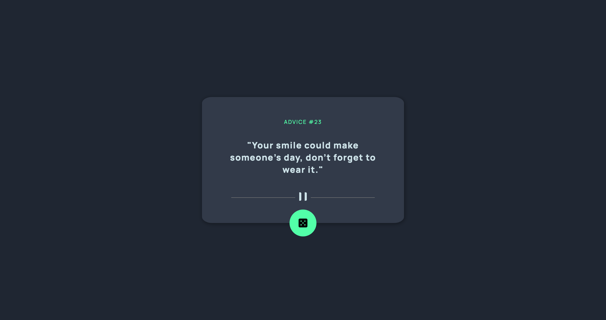

# Frontend Mentor - Advice generator app solution

This is a solution to the [Advice generator app challenge on Frontend Mentor](https://www.frontendmentor.io/challenges/advice-generator-app-QdUG-13db). Frontend Mentor challenges help you improve your coding skills by building realistic projects.

## Table of contents

  - [The challenge](#the-challenge)
  - [Screenshot](#screenshot)
  - [Links](#links)
  - [Built with](#built-with)
  - [What I learned](#what-i-learned)
- [Author](#author)

### The challenge

Users should be able to:

- View the optimal layout for the app depending on their device's screen size
- See hover states for all interactive elements on the page
- Generate a new piece of advice by clicking the dice icon

### Screenshot

### Links

- Solution URL: [Click to view](https://advice-qoutes.netlify.app/)
- Live Site URL: [Click to view](https://advice-qoutes.netlify.app/)

### Built with

- Semantic HTML5 markup
- CSS custom properties
- Flexbox
- CSS Grid
- JavaScript

**Note: These are just examples. Delete this note and replace the list above with your own choices**

### What I learned

I major used Flexbox in structuring my page and also leverage on clamp function to obtained fluid design without the need of writing media query.

## Author

- Website - [Visit my portfolio](https://www.tijanieneye10.github.io/portfolio/)
- Frontend Mentor - [@Tijanieneye10](https://www.frontendmentor.io/profile/Tijanieneye10)
- Twitter - [@tijanieneye](https://www.twitter.com/tijanieneye)
